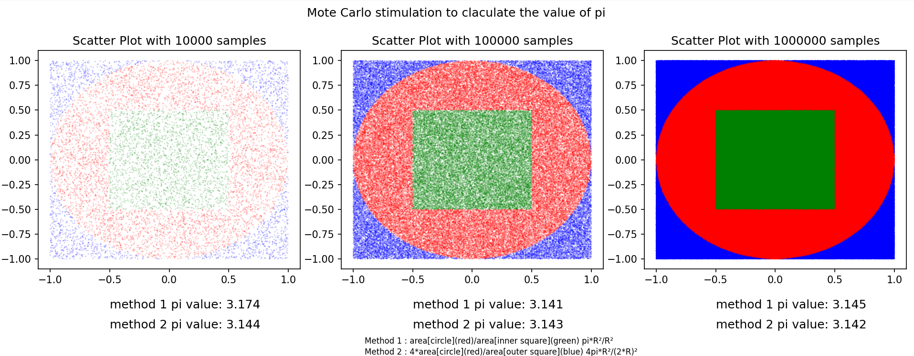

# 1-_chance_99-_faith

## Table of Contents

- [Introduction](#introduction)
- [Monte Carlo Stimulation](#mcs)

## Introduction
A repository to understand and visualize differernt concepts in 
the world of probability relevent to machine learning and data science
through python programs.

## Monte Carlo Stimulation
Using Monte Carlo Stimulation to calculate the value of pi

